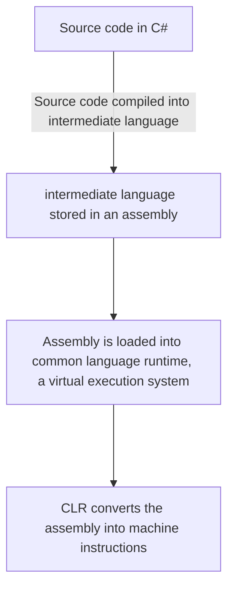

I've had to work on some C# features for work lately, so I wanted to take some time to write down some of the weird things that I've learned. C# allows you to develop an application to be run in .NET. 

